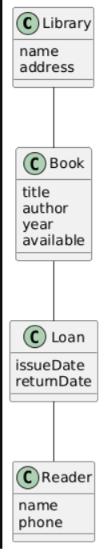

# Система обліку книг у бібліотеці

## Опис проєкту

Цей проєкт представляє програму для обліку книг у бібліотеці.

Програма дозволяє зберігати інформацію про книги, читачів та видачу книг.

## Мета проєкту

Мета проєкту — навчитися працювати з Java, GitHub, IntelliJ IDEA та UML-діаграмами.

## Основні можливості

- додавання книг;
- зберігання інформації про книги;
- облік читачів;
- видача книг читачам;
- повернення книг;
- зберігання інформації про видачу книг.

## Основні класи

### Library

Клас, який представляє бібліотеку.

Основні дані:
- назва бібліотеки;
- адреса.

### Book

Клас, який представляє книгу.

Основні дані:
- назва книги;
- автор;
- рік видання;
- доступність книги.

### Reader

Клас, який представляє читача.

Основні дані:
- ім'я;
- номер телефону.

### Loan

Клас, який представляє видачу книги читачу.

Основні дані:
- дата видачі;
- дата повернення.

## UML-діаграма

UML-діаграма показує основні класи проєкту та зв'язки між ними.

